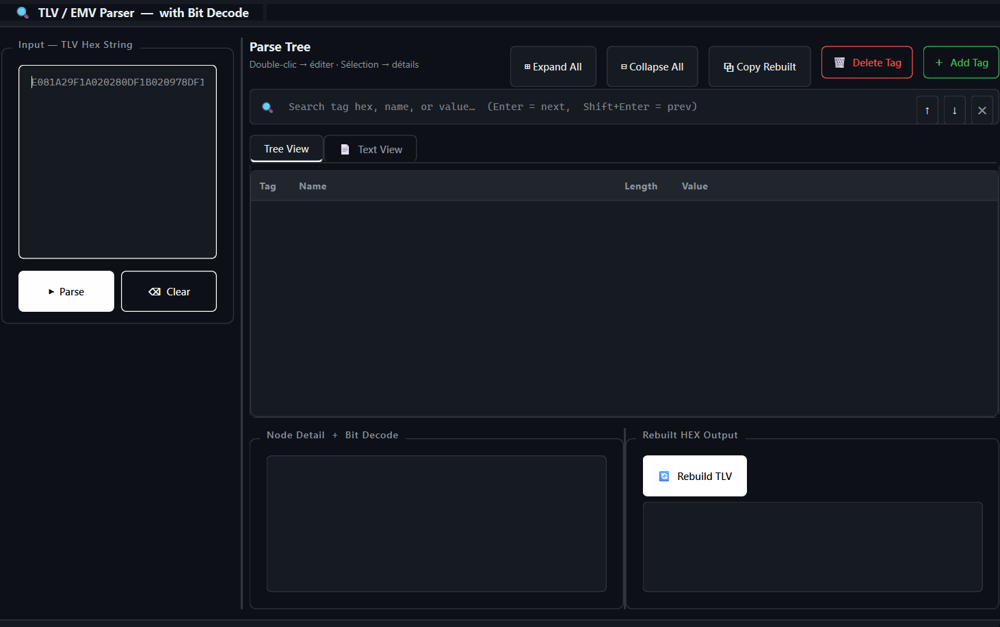

# TLV / EMV Parser

A graphical editor and analyzer for **TLV (Tag-Length-Value)** data, built for decoding **EMV / smart card** data. The application parses, visualizes, edits, and rebuilds hexadecimal TLV strings, with automatic decoding of binary fields (bits/nibbles) based on a customizable tag dictionary.


## ✨ Features

- **Recursive TLV parsing** — decodes both primitive and constructed (nested) tags, including multi-byte tags and multi-byte lengths (BER-TLV).
- **External tag dictionary** (`tags.json`) — tag names and expected length rules, loaded dynamically.
- **Bit/nibble decoding** (`BIT_DEFINITIONS_WITH_POSITIONS.json`) — detailed interpretation of status bytes (e.g. TVR, CVM Results) and position/nibble fields.
- **Interactive editing** — modify a tag's value with automatic length validation.
- **Add / delete tags** — insert at root level or inside any container, with automatic recalculation of parent lengths.
- **TLV rebuild** — regenerates the full hexadecimal string after any edit.
- **Live search** — filter by tag, name, or value, with navigation between results.
- **Tree view + text view** — two synchronized representations of the TLV structure.
- **Anomaly detection** — flags tags with invalid or ambiguous length.

## 📸 Preview



##  Installation

### Requirements
- Python 3.10 or higher

### Steps

```bash
# Clone the repository
git clone https://github.com/<your-username>/tlv-parser.git
cd tlv-parser

# (Recommended) create a virtual environment
python -m venv venv
source venv/bin/activate      # Linux / macOS
venv\Scripts\activate         # Windows

# Install dependencies
pip install -r requirements.txt

# Run the application
python parser.py
```

## 📄 License

Distributed under the MIT License. See [`LICENSE`](LICENSE) for details.
